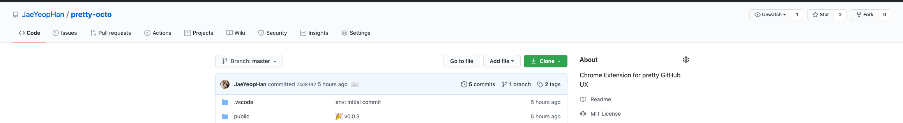
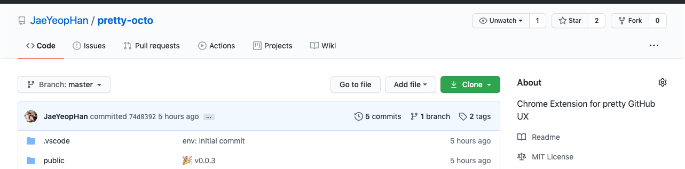

# pretty-octo

Chrome Extension for pretty GitHub UX

## Features

### UI

#### ✅ Apply narrow styles

Apply narow styles to GitHub navbar (with `container-xl`)

|            **Before**            |           **After**            |
| :------------------------------: | :----------------------------: |
|  |  |

> To be continued... ([> issue](https://github.com/JaeYeopHan/pretty-octo/issues/new?template=Feature_request.md))

### 🛠 Based on

- [chrome-extension-typescript-starter](https://github.com/chibat/chrome-extension-typescript-starter)

## Show your support

Give a ⭐️ if this project helped you!

  
    Written by <a href="https://github.com/JaeYeopHan">@Jbee</a>
  
  <small>✌</small>

